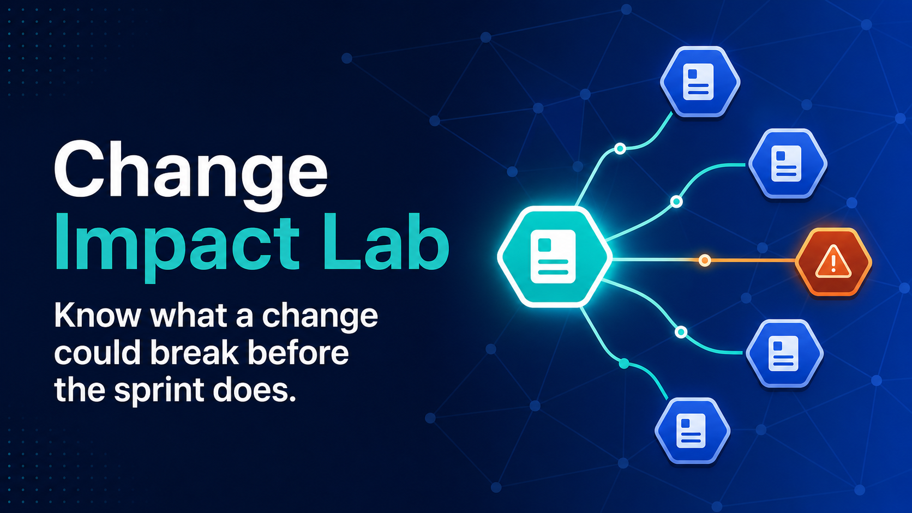

<div align="center">

# Change Impact Lab

### Know what a change could break before the sprint does.

An evidence-first Jira dependency explorer that turns issue links into a visual blast-radius map and lets teams question the visible graph in plain language.

[](https://nextjs.org/)
[](https://react.dev/)
[](https://www.atlassian.com/software/jira)
[](https://developers.openai.com/api/)
[](https://openai.com/codex/)
[](LICENSE)

[Report an issue](https://github.com/divergent99/ImpactLab/issues) · [View the repository](https://github.com/divergent99/ImpactLab)

</div>

Change Impact Lab is a read-only change-intelligence workspace for Jira. Pick a work item, traverse its direct and downstream relationships, inspect the evidence behind every connection, and ask grounded questions about the work currently in view.

It is deliberately narrower than a general Jira assistant. The product focuses on one decision teams repeatedly struggle to make: **if we change this issue, what else deserves attention before implementation begins?**



## Why Change Impact Lab

Jira already stores useful dependency evidence, but that evidence is scattered across issue links, parent-child relationships, priorities, descriptions, and individual work-item pages. Reviewing a risky change often means opening many tabs and reconstructing the dependency chain mentally.

Change Impact Lab makes that chain visible:

1. Select a Jira issue as the proposed root change.
2. Traverse one to three levels of connected work.
3. Inspect affected work, blockers, child issues, elevated priorities, and confidence.
4. Click any node to see why it appears in the graph.
5. Ask the impact map a question and receive an answer with inline Jira citations.
6. Open the cited issue in Jira to verify the source.

The result is not an autonomous project manager. It is a review surface that helps a human make a better-informed change decision.

## Highlights

- Live, read-only Jira Cloud integration through the Jira REST API v3.
- Visual blast-radius map built from explicit issue links and parent-child relationships.
- Adjustable traversal depth from one to three hops.
- Root change, affected work, blockers, elevated-risk work, child work, risk signal, and relationship-confidence statistics.
- Evidence panel explaining why each issue is present and how strong the relationship is.
- Direct links back to Jira for source verification.
- Evidence-grounded chat powered by the OpenAI Responses API.
- Required inline issue-key citations such as `[SCRUM-2]` for material claims.
- Streaming chat interface with visible model-connection and loading states.
- Fixture fallback so the dependency experience remains explorable without Jira credentials.
- Explicit read-only boundary: the application never creates, edits, assigns, or transitions Jira issues.
- Responsive dashboard designed for desktop review sessions and smaller screens.

## The graph is deterministic; the explanation is model-assisted

Change Impact Lab does not ask a language model to invent the dependency graph.

```text
Selected Jira issue
        |
        v
Deterministic breadth-first traversal
        |
        +---- issue links
        +---- parent / child relationships
        |
        v
Visible impact graph + computed statistics
        |
        v
Bounded graph context sent to GPT
        |
        v
Grounded answer with [ISSUE-KEY] citations
```

The application computes graph membership, traversal depth, counts, and evidence from structured Jira data. The model receives only the active graph context and conversation history. Its job is to explain and synthesize that evidence—not to decide which issues exist or claim it changed Jira.

When the supplied evidence cannot support an answer, the chat prompt instructs the model to say so.

## Architecture

```text
Browser UI (Next.js + React)
          |
          +---- GET /api/jira/graph
          |             |
          |             v
          |      Jira Cloud REST API v3
          |
          +---- POST /api/chat
                        |
                        +---- active graph context
                        +---- recent conversation
                        |
                        v
                 OpenAI Responses API
```

The UI and server routes run in one Next.js/Vinext application. Jira credentials and the OpenAI API key are read only on the server and are never rendered into the browser bundle.

An optional FastAPI implementation is included under `backend/`. It contains the deterministic impact engine and provides a path toward an independently deployed service, scheduled analysis, or a larger agent workflow without making that complexity necessary for the MVP.

## Run locally

Requirements:

- Node.js 22.13 or newer
- npm
- A Jira Cloud account with access to the project you want to inspect
- An Atlassian API token for live Jira data
- An OpenAI API key for evidence-grounded chat

### Windows PowerShell

```powershell
git clone https://github.com/divergent99/ImpactLab.git
cd ImpactLab
npm install
Copy-Item .env.example .env.local
npm run dev
```

### macOS or Linux

```bash
git clone https://github.com/divergent99/ImpactLab.git
cd ImpactLab
npm install
cp .env.example .env.local
npm run dev
```

Open [http://127.0.0.1:3000](http://127.0.0.1:3000).

## Connect Jira and OpenAI

Edit `.env.local`:

```env
JIRA_BASE_URL=https://your-domain.atlassian.net
JIRA_EMAIL=you@example.com
JIRA_API_TOKEN=paste-your-jira-api-token-here

OPENAI_API_KEY=paste-your-openai-api-key-here
OPENAI_MODEL=gpt-5.6-terra
```

Create an Atlassian API token from your Atlassian account security settings. The token acts with the permissions of the associated Jira account, so use an account with the minimum project access required for the demo.

Restart the development server after changing environment variables. The header should change from **DEMO DATA** to **JIRA CONNECTED** when the Jira request succeeds; the chat footer separately reports whether the model connection is configured.

Never commit `.env.local`, paste secrets into frontend code, or expose them in screenshots. The repository tracks only the safe `.env.example` template.

## Configuration

| Variable | Required | Purpose |
|---|---:|---|
| `JIRA_BASE_URL` | For live Jira | Jira Cloud site URL, without a trailing slash |
| `JIRA_EMAIL` | For live Jira | Email associated with the Atlassian API token |
| `JIRA_API_TOKEN` | For live Jira | Server-side credential used for read-only REST requests |
| `OPENAI_API_KEY` | For chat | Enables evidence-grounded questions over the active graph |
| `OPENAI_MODEL` | Optional | Responses API model; defaults to `gpt-5.6-terra` |

## Demo mode and current Jira scope

If Jira credentials are absent or the graph request fails, the interface falls back to a bundled `SCRUM` scenario. This fallback is intentionally labeled **DEMO DATA — NOT LIVE** so fixture evidence cannot be mistaken for production Jira data.

The current MVP UI targets the configured `SCRUM` project and the Jira route reads up to 50 issues at a time. The API validates project keys before including them in JQL. Arbitrary project selection, pagination beyond 50 issues, and multi-site OAuth are future work rather than hidden claims.

## API

| Method | Endpoint | Purpose |
|---|---|---|
| `GET` | `/api/jira/graph?project=SCRUM` | Read Jira issues and return normalized nodes and relationships |
| `GET` | `/api/chat` | Report whether model chat is configured and which model is selected |
| `POST` | `/api/chat` | Answer from the supplied active graph and stream SSE events to the UI |

### Graph response

`GET /api/jira/graph` reads summaries, statuses, priorities, issue types, descriptions, links, parents, and subtasks. Jira Atlassian Document Format descriptions are flattened into plain text before they enter the UI context.

### Chat contract

`POST /api/chat` receives:

- The user question
- Root and selected issue keys
- Traversal depth
- Visible issues and relationships
- Up to six recent chat messages

The response is delivered as Server-Sent Events with `meta`, `delta`, and `done` event payloads. Material claims are expected to cite their supporting Jira issue keys inline.

## Trust model

| Concern | MVP behavior |
|---|---|
| **Jira mutations** | None. The application performs read-only searches and links back to Jira. |
| **Permissions** | Jira returns only what the API-token account is authorized to access. |
| **Graph construction** | Deterministic traversal over normalized relationships; not generated by the model. |
| **Model context** | Limited to the active visible graph and recent conversation supplied by the browser. |
| **Traceability** | Nodes expose relationship evidence; chat requires issue-key citations. |
| **Missing evidence** | The model is instructed to acknowledge insufficient context instead of fabricating support. |
| **Secret handling** | Jira and OpenAI credentials remain in server-side environment variables. |

API-token authentication is appropriate for this personal MVP. A multi-user production service should replace shared credentials with Atlassian OAuth 2.0 (3LO), isolate each tenant, implement audit logging, and define data-retention controls.

## Demo walkthrough

1. Confirm the header says **JIRA CONNECTED** or clearly indicates fixture mode.
2. Select `SCRUM-2` and choose **Analyze impact**.
3. Move traversal depth from one to three and watch the graph and statistics recompute.
4. Select a connected issue and inspect the evidence panel.
5. Ask: `What could block this change?`
6. Confirm the answer cites Jira keys such as `[SCRUM-2]`.
7. Open a cited issue in Jira and compare the answer with the source.
8. Review the generated pre-implementation actions without allowing the application to modify Jira.

## Project structure

```text
ImpactLab/
|-- app/
|   |-- api/
|   |   |-- jira/graph/route.ts   # live Jira graph normalization
|   |   `-- chat/route.ts         # grounded Responses API chat
|   |-- globals.css               # dashboard and responsive styling
|   |-- layout.tsx                # metadata and root layout
|   |-- page.tsx                  # graph, evidence, stats, and chat UI
|   `-- scenario.ts               # labeled fixture fallback
|-- backend/
|   |-- app/                       # optional FastAPI impact service
|   `-- tests/                     # deterministic traversal tests
|-- public/
|   |-- favicon.svg
|   `-- og.png                     # repository/social preview
|-- tests/                         # application render checks
|-- .env.example                   # safe configuration template
|-- LICENSE                        # MIT license
|-- package.json
`-- vite.config.ts
```

## Validation

Build the production bundle:

```powershell
npm run build
```

Run the deterministic Python impact-engine tests if Python is available:

```powershell
python -m unittest backend.tests.test_impact_engine
```

The impact-engine tests verify that traversal depth changes graph membership and that issue keys are normalized consistently.

## Built with Codex

Change Impact Lab was built through an iterative human-agent workflow. I defined the product direction, tested the Jira experience, challenged visual and functional decisions, and retained final judgment. **OpenAI Codex worked alongside me as an engineering and design collaborator.**

Codex helped:

- Narrow a broad “unified Jira agent” concept into a differentiated blast-radius product.
- Design and implement the evidence-first dashboard, graph, statistics, and responsive interface.
- Integrate Jira Cloud without exposing credentials in the browser.
- Build grounded chat with explicit citation and refusal requirements.
- Debug relationship arrows, graph density, loading feedback, fixture labeling, and local preview behavior.
- Verify live Jira responses, production builds, secret hygiene, Git history, and repository documentation.

The collaboration was iterative rather than one-shot generation: ideas were tested in the browser, rejected when they felt weak, refined from screenshots, and verified against live Jira data before being accepted.

## Roadmap

- Atlassian OAuth 2.0 (3LO) and tenant-aware authorization
- Project discovery instead of the current fixed project selector
- Pagination and automatic layout for large, irregular Jira graphs
- Components, owners, releases, incidents, and deployment signals
- Shareable analysis URLs with reproducible graph snapshots
- Markdown or PDF change-review exports
- Saved baselines for comparing blast radius before and after ticket edits
- Evaluation fixtures for citation correctness and unsupported-claim refusal
- Optional Slack or Teams delivery without turning the product into a generic chatbot

## Scope and limitations

Change Impact Lab is an independent prototype and is not affiliated with or endorsed by Atlassian. Jira is a trademark of Atlassian.

The graph is only as complete as the relationships recorded in Jira. Missing links, stale descriptions, inconsistent issue types, and restricted projects can all produce an incomplete blast radius. Confidence describes the strength of visible relationship evidence; it is not a probability that a software change will fail.

The application supports engineering review—it does not replace code analysis, testing, service ownership, security review, or human approval.

## License

Change Impact Lab is available under the [MIT License](LICENSE).

---

<div align="center">

Built by [Abhineet Sharma](https://github.com/divergent99) with OpenAI Codex.

**Trace the change. Inspect the evidence. Review the risk.**

</div>
